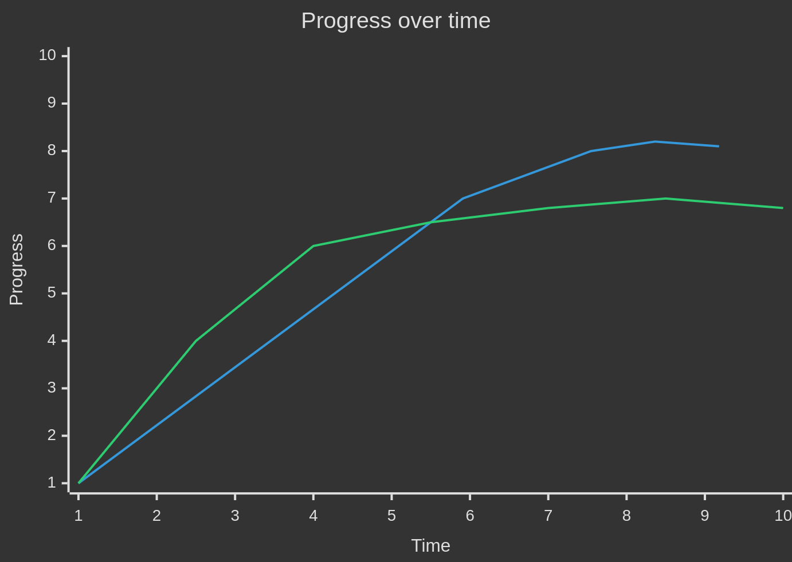

## Chapter 3 - Working code isn't enough

### 3.1 Tactical Programming
Most organizations and developers focus on *tactical programming*. In this approach, your main focus is to get something working. The problem with this is thi's very short-sighted. Trying to finish a task as soon as possible introduces small amounts of complexity. As discussed in the previous chapter, this is how systems become complex.

### 3.2 Strategic Programming
The first step in becoming a good software designer is to realize that ***working code isn't enough***. The most important thing is the long term structure of the system. Most code is written by extending the existing codebase, so your most important job as a dev is to facilitate those future extensions. This is *strategic programming*.

Strategic programming requires an investment mindset and some of those investments will be proactive. For example, try multiple ideas to find a simple design for a new class / feature instead of just implementing the first idea. Writing good documentation is another example of a proactive investment.

### 3.3 How much to invest?
The best approach is to make lost of small investments on a continual basis (~10-20% of dev time).

The term *technical debt* is often used to describe the problems caused by tactical programming. By programming tactically, you are borrowing time from the future. And just like financial debt, the amount you pay back will be more than the amount you borrowed. Unlike financial debt, most tech debt is never repaid.

--- Tactical programming

--- Strategic programming

### 3.4 Startups and investment
Sometimes there are strong forces working against the strategic approach (e.g. startups often take a tactical approach). However, know that once a codebase becomes spaghetti is is nearly impossible to fix.

Best way to lower development cost is to hire great engineers; and great engineers care deeply about good design.

Facebook is an example of a startup with a tactical approach. Their motto for years was *Move fast and break things*. Over time they realized this was unsustainable and changed their motto to *Move fast with solid infrastructure*. 

Google and VMWare are examples of companies that took a strategic approach.
